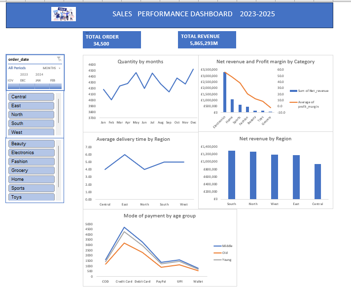

# DATA ANALYTICS PORTFOLIO  
## Project 1 

**Title** Sales performance Dashboard 2023-2025

**Tools Used** Microsoft excel(),Pivot tables, timelines , slicers.

**Project Description** 
An interactive sales analysis dashboard analysing  2023-2025
performance data across regions, products categories, and customer demographics to track growth,
evaluate delivery efficiency ,and optimise profit margins.

**Key Findings**
* **Revenue Concentrated** The business generated **5.87M in net revenue** across 34,500 total orders**, driven predominantly by Electronics (£3.32M)
* **Margin Compression:** Profitability scales directly with product volume; high-performing lines yield margins up to **55.7**,while  low volume lines
  dropping to **-2.3**in groceries.
* ** Logistical Disparities:**Delivery turn around times range from **4.0 to 6.0 days** across geographical entities, highlighting potential fulfillment
  bottlenecks in the eastern region.
* ** Method of payment**  Credit card represents the dominant mode of payment across all demographic,revealing the highest rate among the middle age
  consumers

---

| Visual Component | Performance Metrics & Analysis focus |
| :---| :---|
| **Executive KPI Summary** |Displays high-level operations performance  (**34,500 Total orders** \| **£5,865,293 Total Revenue**) . |
| **Control slicers** | Interactive multi-filter allowing dynamic segmentation by **Order Date**, **Territory**, and **Product line**. | 
| **Monthly order Volume** | Line chart tracking the cyclical purchasing patterns  and sales seasonality. |
| **Category Profitability** | Dual-axis combination, visual evaluating net sales volume against average profit margin per category. |
| **Regional logistics** |Performance tracking regional order to delivery measured in days. |
| ** Regional sale Distribution** |Comparative bar chart illustrating revenue balance across operating regions lead by the South . |
| **Demographic payment channels** |Multi-series  trends illustrating payment preferences across age segments. |

  
  

 **Dashboard overview**
 
  
