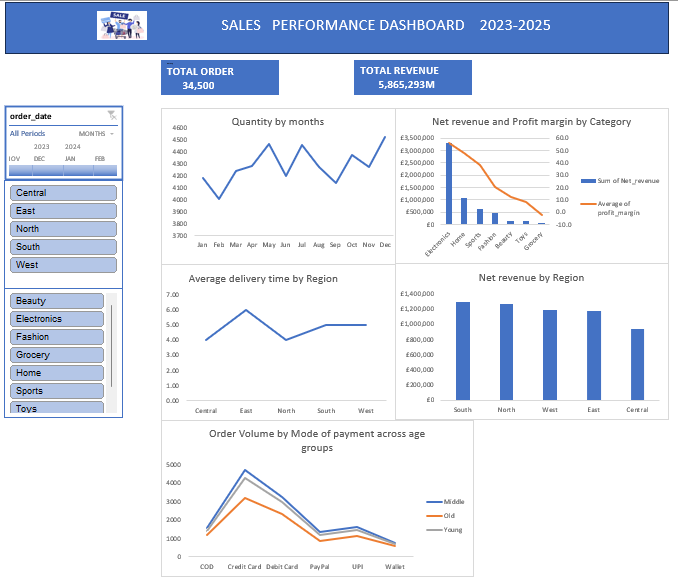

# DATA ANALYTICS PORTFOLIO  
## Project 1 

**Title:** Sales performance Dashboard 2023-2025

**Tools Used:** Microsoft excel,  Power query(data cleaning & transformation)  Pivot tables, Timelines , Slicers.

**Project Description** 
An interactive sales analysis dashboard analysing  2023-2025
performance data across regions, products categories, and customer demographics to track growth,
evaluate delivery efficiency ,and optimise profit margins.

**Key Findings**
* **Revenue Concentrated:** The business generated **5.87M in net revenue** across **34,500 total orders**, driven predominantly by Electronics (£3.32M).
* **Margin Compression:** Profitability scales directly with product volume; high-performing lines yield margins up to **55.7%**, while  low volume lines
  dropping to **-2.3%**in groceries.
* **Logistical Disparities:** Delivery turn around times range from **4 to 6 days** across geographical entities, highlighting potential fulfillment
  bottlenecks in the eastern region.
* **Method of payment:** Credit card represents the dominant mode of payment across all demographic ,revealing the highest rate among the middle age
  consumers

---

| Visual Component | Performance Metrics & Analysis focus |
| :---| :---|
| **Executive KPI Summary** |Displays high-level operations performance  (**34,500 Total orders** \| **£5,865,293 Total Revenue**) . |
| **Control slicers** | Interactive multi-filter allowing dynamic segmentation by **Order Date**, **Territory**, and **Product line**. | 
| **Monthly order Volume** | Line chart tracking the cyclical purchasing patterns  and sales seasonality. |
| **Category Profitability** | Dual-axis combination, visual evaluating net sales volume against average profit margin per category. |
| **Regional logistics** |Performance tracking regional order to delivery measured in days. |
| **Regional sale Distribution** |Comparative bar chart illustrating revenue balance across operating regions lead by the South . |
| **Demographic payment channels** |Multi-series trends illustrating order volume by payment preferences across age segments. |

  
  

 **Dashboard overview**
 
  

## Project 2

 
**Title:** [View 2023-2025 SALES AND REVENUE  DASHBOARD](SALES2.png)

**tools used:** Excel, Power Bi , Power query(Data cleaning and transformation), Data visualisation and Data Analysis and Expression (DAX) 

**Project Description:** This Power interactive dashboard analyses retail sales performance across a three period ,built from retail data ,the project an end-end view of overall revenue, order by volume ,regional performance and product subcategory.
The aim is to assist stakeholders key revenue metrics ,understand customer purchasing behaviours across region,  optimize inventory distribution based on demand by subcategory

**key Findings:** 
* **Total revenue and sales volume:** Generated **$15.47M** in net revenue across 5000 total orders ,achieving an average order of value of **$3.09** and moving **15000** units .
* **Regional perfomance:** The **Eastern** region emerged as the dorminant market, significantly outperforming south ,west and north regions respectively in total quantity sold.
* **Sales trend over time:** Sales activities peaked sharply in 2024 before stabilising ,highlighting a key period of operational growth.
* **Product insights:** high-tech subcategory led by **Smartphones** and **Accessories** accounted for the highest volume of units sold overall.
* **Sales by gender:** Women drive  majority of sales volume,**key metrics female(56.4%) versus 43.6% male .High engagement across both segments means cross-gender marketing campaigns offer thew best return on returns. 
* **Payment Methods**Customers transaction were evenly distributed across payment options (**Credit cards ,mobile money ,cash and bank transfers**),indicating that customers utilized a broad range of payment channels without ant single dorminant preference  

**Dashboard Overview** 

